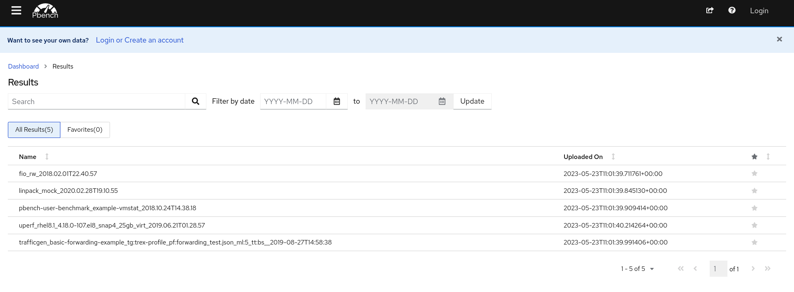
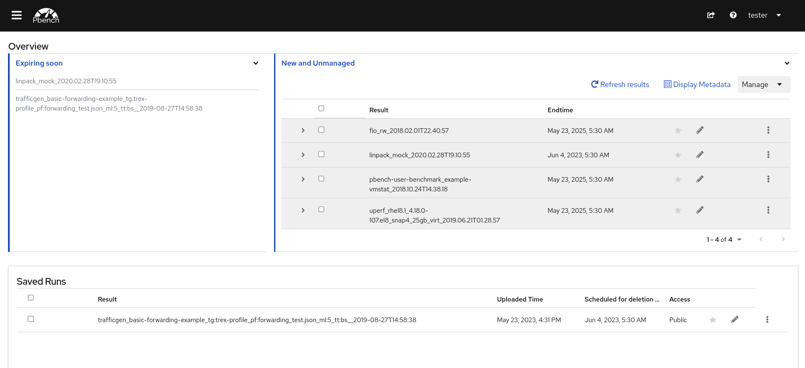
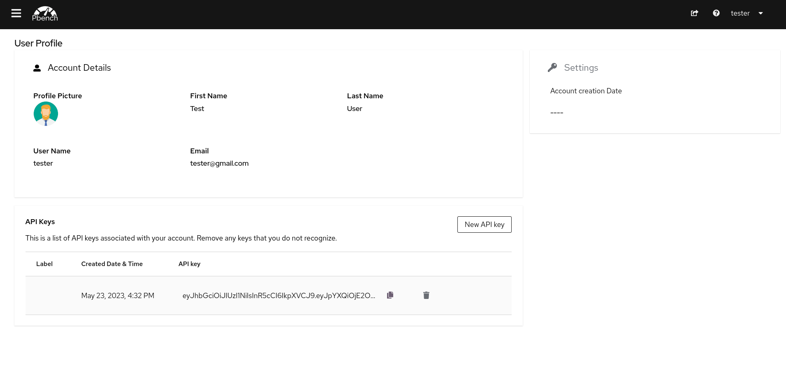

# Pbench Dashboard

Pbench Dashboard is the web-based platform for consuming indexed performance benchmark data. It provides data curation capabilities for the performance datasets.

The landing page is the browsing page where the user can view the list of public datasets. Those datasets can be filtered based on name and/or uploaded time.

Login button can be found on the right side of the Header. Clicking on it will redirect the browser to the login page.

On logging in, the user can view the Overview Page which is the data curation page.
It has three components.

- *New and Unmanaged Runs* shows the newly created runs which can be saved
- *Saved Runs* lists the saved runs which can be published to share with others
- *Expiring Runs* lists the saved runs which will be deleted from the server within the next 20 days

The *User Profile* page can be used to view profile information from the OIDC authentication as well as to view and manage Pbench Server API keys. This page is accessed by selecting the *My profile* option from the dropdown menu activated by clicking on the username at the right end of the header bar.

From this page, Pbench Server API keys can be created by clicking on the *New API Key* button; existing keys are listed with their labels and creation dates; and, the keys can be copied or deleted using the icon buttons.

